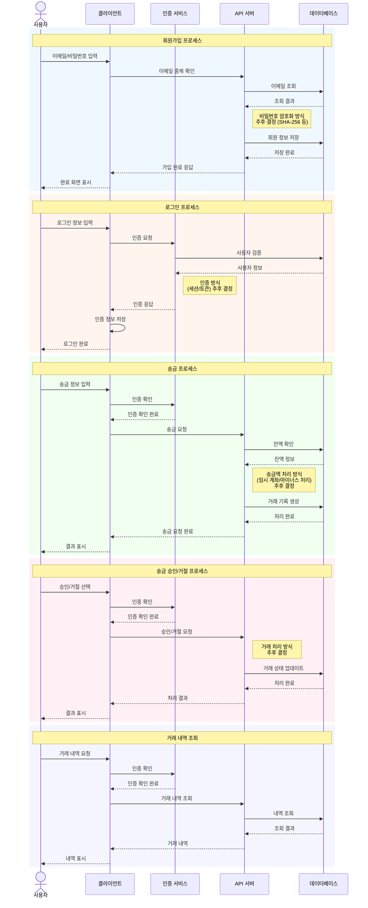

# sendzy

## 프로젝트 기획

### 필수 기능

회원 가입
- OAuth는 현재로써 고려하지 않음
- 회원 데이터는 암호화에 대한 이해를 위해 id, password를 입력하는 형태로 구현
- id는 이메일 형태로 입력 받고, 중복 검사를 진행
- 패스워드는 SHA-256과 같은 단방향 해시를 검토

로그인
- id, password를 입력받아 로그인
- 로그인 상태 관리는 세션 방식과 토큰 방식을 고려하며, 인증 방식에 대한 학습 후 확정 예정
- 패스워드가 네트워크를 통해 전송될 때 통신 안전을 위해 SSL 레이어 도입 예정(HTTPS)

송금
- 송금할 대상의 이메일(혹은 계좌번호)을 입력하고, 송금할 금액을 입력
- 이메일 입력 시 회원 가입 여부 확인. 가입된 회원에게만 송금 가능하도록 구현
- 송금 요청 시 거래 내역에 송금 이력을 추가
- 송금 요청 시 수취인이 수락할 때까지 출금에 대한 아래 2가지 방식 고려
    1. 중간 계좌를 만들어 중간 계좌에 돈을 예치해 두는 방식
    2. 계좌의 총액은 그대로인 채 마이너스 이력을 남기는 방식

송금 취소
- 수취인은 송금을 수락할 수도, 수락하지 않을 수도 있음
- 수취인이 수락하지 않았을 경우 송금 취소 가능
- 수취인이 3일 동안 수락하지 않을 경우 자동으로 송금 취소

수취
- 수취 요청을 수락하면 거래 내역에 수취 이력을 추가
- 수취인이 송금을 거절할 수 있음. 거절된 경우 거래가 취소되고 거래 내역에 반영

거래 내역 및 잔액 조회
- 인증된 사용자는 거래 내역을 조회할 수 있음. 이 때 거래 내역은 사용자가 송금하거나 수취한 내역만 보여야함
- 인증된 사용자는 본인 계좌의 잔액을 조회할 수 있음. 잔액은 송금, 수취 내역과 불일치가 발생하지 않아야 하며, 데이터의 일관성에 유의해야 함

### 추가 기능

예약 송금
- 지정한 날짜, 시간에 지정한 금액을 송금
- 매일, 매주, 매달 등 자동 이체 형태로 기능 확장 가능

## 와이어 프레임

## 시퀀스 다이어그램

## ERD

