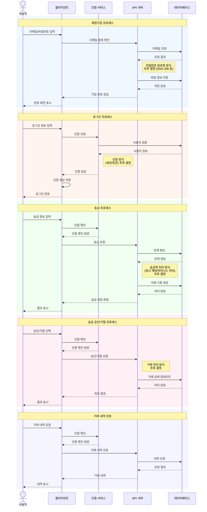

# sendzy

## 시퀀스 다이어그램

```mermaid
sequenceDiagram
    actor User as 사용자
    participant Client as 클라이언트
    participant Auth as 인증 서비스
    participant API as API 서버
    participant DB as 데이터베이스

    %% 회원가입 프로세스
    rect rgb(240, 248, 255)
        Note over User, DB: 회원가입 프로세스
        User->>Client: 이메일/비밀번호 입력
        Client->>API: 이메일 중복 확인
        API->>DB: 이메일 조회
        DB-->>API: 조회 결과
        
        Note right of API: 비밀번호 암호화 방식<br/>추후 결정 (SHA-256 등)
        
        API->>DB: 회원 정보 저장
        DB-->>API: 저장 완료
        API-->>Client: 가입 완료 응답
        Client-->>User: 완료 화면 표시
    end

    %% 로그인 프로세스
    rect rgb(255, 245, 238)
        Note over User, DB: 로그인 프로세스
        User->>Client: 로그인 정보 입력
        Client->>Auth: 인증 요청
        Auth->>DB: 사용자 검증
        DB-->>Auth: 사용자 정보
        
        Note right of Auth: 인증 방식<br/>(세션/토큰) 추후 결정
        
        Auth-->>Client: 인증 응답
        Client->>Client: 인증 정보 저장
        Client-->>User: 로그인 완료
    end

    %% 송금 프로세스
    rect rgb(240, 255, 240)
        Note over User, DB: 송금 프로세스
        User->>Client: 송금 정보 입력
        Client->>Auth: 인증 확인
        Auth-->>Client: 인증 확인 완료
        Client->>API: 송금 요청
        API->>DB: 잔액 확인
        DB-->>API: 잔액 정보
        
        Note right of API: 송금액 처리 방식<br/>(임시 계좌/마이너스 처리)<br/>추후 결정
        
        API->>DB: 거래 기록 생성
        DB-->>API: 처리 완료
        API-->>Client: 송금 요청 완료
        Client-->>User: 결과 표시
    end

    %% 송금 승인/거절 프로세스
    rect rgb(255, 240, 245)
        Note over User, DB: 송금 승인/거절 프로세스
        User->>Client: 승인/거절 선택
        Client->>Auth: 인증 확인
        Auth-->>Client: 인증 확인 완료
        Client->>API: 승인/거절 요청
        
        Note right of API: 거래 처리 방식<br/>추후 결정
        
        API->>DB: 거래 상태 업데이트
        DB-->>API: 처리 완료
        API-->>Client: 처리 결과
        Client-->>User: 결과 표시
    end

    %% 거래 내역 조회
    rect rgb(245, 245, 255)
        Note over User, DB: 거래 내역 조회
        User->>Client: 거래 내역 요청
        Client->>Auth: 인증 확인
        Auth-->>Client: 인증 확인 완료
        Client->>API: 거래 내역 조회
        API->>DB: 내역 조회
        DB-->>API: 조회 결과
        API-->>Client: 거래 내역
        Client-->>User: 내역 표시
    end
```
